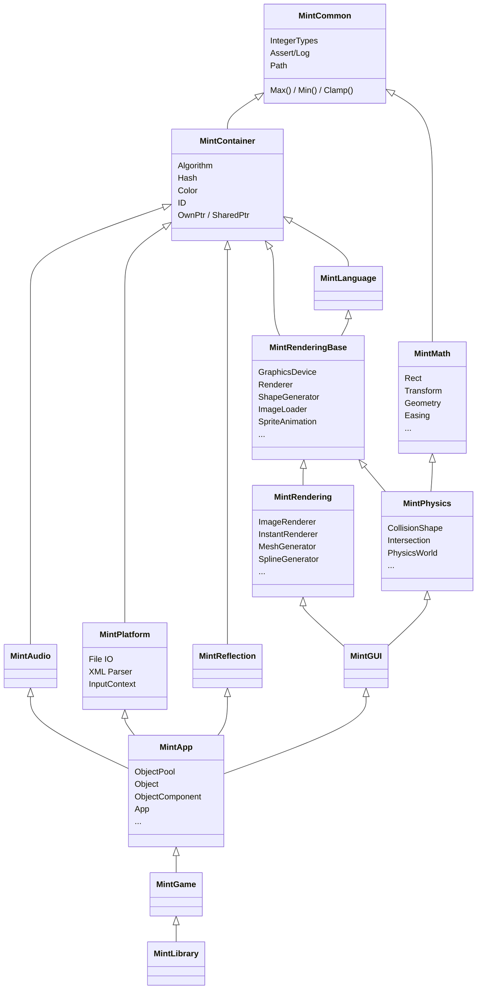

# MintLibrary

```mermaid
classDiagram
    MintCommon <|-- MintContainer
    MintCommon <|-- MintMath

    MintContainer <|-- MintAudio
    MintContainer <|-- MintPlatform
    MintContainer <|-- MintRenderingBase
    MintContainer <|-- MintReflection
    MintContainer <|-- MintLanguage

    MintLanguage <|-- MintRenderingBase

    MintRenderingBase <|-- MintRendering

    MintRenderingBase <|-- MintPhysics
    MintMath <|-- MintPhysics

    MintRendering <|-- MintGUI
    MintPhysics <|-- MintGUI

    MintAudio <|-- MintApp
    MintPlatform <|-- MintApp
    MintReflection <|-- MintApp
    MintGUI <|-- MintApp

    MintApp <|-- MintGame

    MintGame <|-- MintLibrary

    class MintCommon{
        IntegerTypes
        Assert/Log
        Path
        Max() / Min() / Clamp()
    }
    class MintContainer{
        Algorithm
        Hash
        Color
        ID
        OwnPtr / SharedPtr
    }
    class MintPlatform{
        File IO
        XML Parser
        InputContext
    }
    class MintMath{
        Rect
        Transform
        Geometry
        Easing
        ...
    }
    class MintRenderingBase{
        GraphicsDevice
        Renderer
        ShapeGenerator
        ImageLoader
        SpriteAnimation
        ...
    }
    class MintRendering{
        ImageRenderer
        InstantRenderer
        MeshGenerator
        SplineGenerator
        ...
    }
    class MintPhysics{
        CollisionShape
        Intersection
        PhysicsWorld
        ...
    }
    class MintApp{
        ObjectPool
        Object
        ObjectComponent
        App
        ...
    }
```